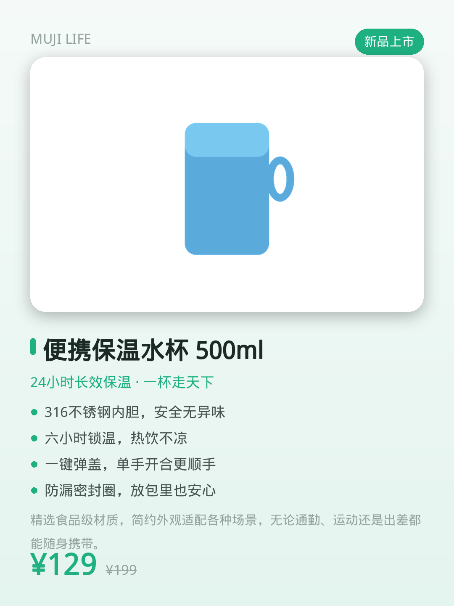
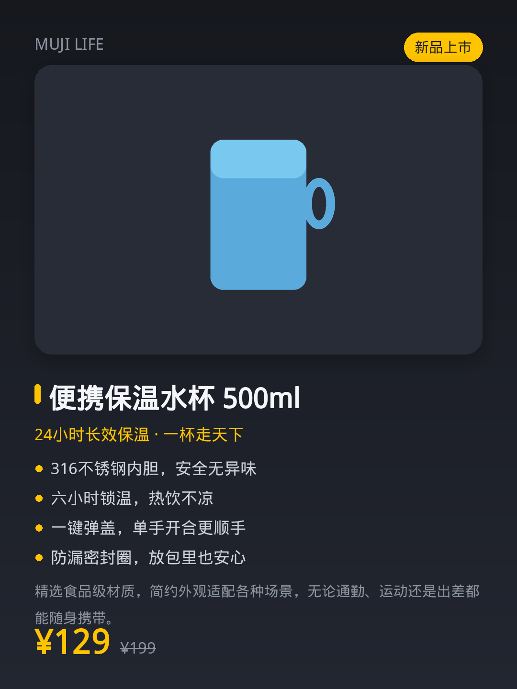
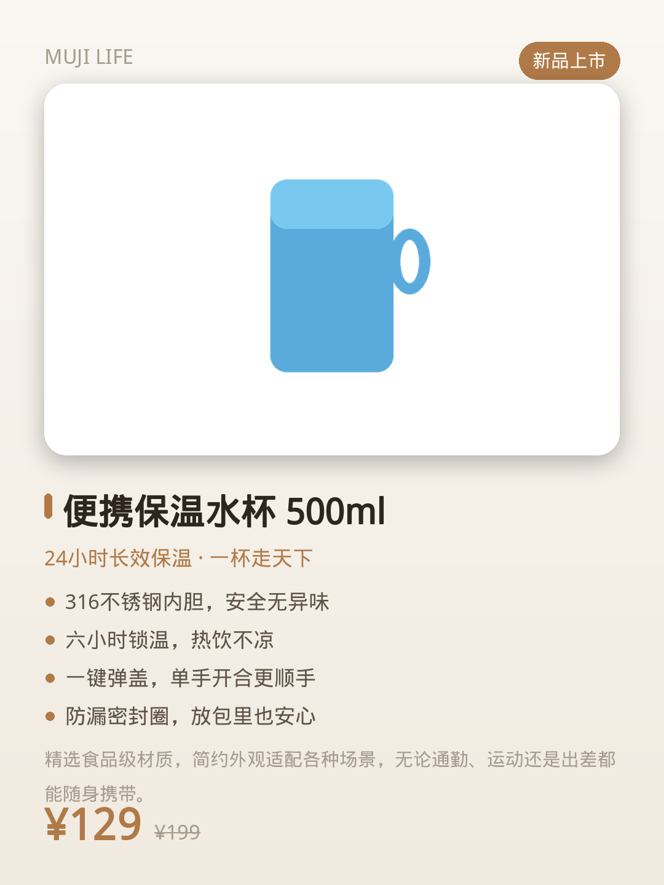

# 🛍️ 商品介绍图生成器 (Product Intro Image Generator)

给程序一张**商品图片**，它就能帮你合成一张精美的、电商风格的**商品介绍图**
（带标题、卖点、价格、品牌、主题配色等排版）。

- 🖼️ **纯本地排版**：核心功能用 [Pillow](https://python-pillow.org/) 实现，不需要联网，开箱即用。
- 🤖 **可选 AI 文案**：配置兼容 OpenAI 的视觉模型后，可让模型"看图"自动生成中文商品文案。
- 🌈 **5 套主题配色**：`fresh` / `dark` / `elegant` / `vivid` / `ocean`。
- 💻 **两种用法**：友好的网页界面 + 支持批量的命令行工具。
- 🈶 **中文友好**：自动寻找系统中文字体，渲染不乱码。

## 效果预览

| fresh | dark | elegant |
|---|---|---|
|  |  |  |

## 安装

```bash
# 核心功能只需要 Pillow
pip install Pillow

# 如需网页界面与 AI 文案，安装全部依赖
pip install -r requirements.txt
```

## 用法一：网页界面（最简单）

```bash
python -m productcard.webapp
```

然后在浏览器打开终端提示的地址，上传图片 → 填写或让 AI 生成文案 → 点击生成。

## 用法二：命令行

```bash
# 手动指定文案
python -m productcard.cli photo.jpg -o output \
    --title "便携保温水杯 500ml" \
    --tagline "24小时长效保温" \
    --points "316不锈钢内胆" "六小时锁温" "一键弹盖" \
    --price "¥129" --original-price "¥199" \
    --brand "MUJI LIFE" --badge "新品" --theme fresh

# 用 JSON 文件提供文案
python -m productcard.cli photo.jpg -o output --info info.json

# 批量处理整个文件夹
python -m productcard.cli ./photos -o output --theme ocean
```

`info.json` 示例：

```json
{
  "title": "便携保温水杯 500ml",
  "tagline": "24小时长效保温 · 一杯走天下",
  "selling_points": ["316不锈钢内胆", "六小时锁温", "一键弹盖", "防漏密封圈"],
  "description": "精选食品级材质，简约外观适配各种场景。",
  "price": "¥129",
  "original_price": "¥199",
  "brand": "MUJI LIFE",
  "badge": "新品"
}
```

## 用法三：AI 自动看图生成文案（可选）

配置好兼容 OpenAI 的视觉模型后，加上 `--ai` 即可让模型根据图片自动生成中文文案：

```bash
export OPENAI_API_KEY="你的密钥"
# 可选：自定义服务地址与模型
export OPENAI_BASE_URL="https://api.openai.com/v1"
export PRODUCTCARD_MODEL="gpt-4o-mini"

python -m productcard.cli ./photos -o output --ai --theme elegant
```

> 在网页界面里勾选 **"AI 自动文案"** 也能达到同样效果。
> 没有配置密钥时，程序会自动回退到手动/默认文案，不会报错。

## 作为库调用

```python
from PIL import Image
from productcard import compose_card, ProductInfo

img = Image.open("photo.jpg")
info = ProductInfo(
    title="便携保温水杯",
    selling_points=["长效保温", "防漏设计"],
    price="¥129",
)
card = compose_card(img, info, theme="fresh")
card.save("card.png")
```

## 自定义字体

中文渲染默认会在系统常见路径中寻找中文字体（如文泉驿、Noto CJK、PingFang、微软雅黑）。
如需指定字体，设置环境变量：

```bash
export PRODUCTCARD_FONT="/path/to/your/font.ttf"
```

## 项目结构

```
productcard/
├── compose.py   # 核心：Pillow 排版引擎
├── theme.py     # 主题配色
├── fonts.py     # 中文字体发现
├── model.py     # 商品信息数据模型
├── analyze.py   # 可选：AI 视觉文案生成
├── cli.py       # 命令行接口
└── webapp.py    # Gradio 网页界面
```
